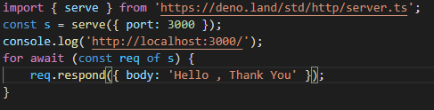

# DENO


## 설치 방법

choco 설치 기준

```javascript
choco install deno
```

```javascript
deno run https://deno.land/std@0.81.0/examples/welcome.ts
// console.log("Welcome to Deno 🦕");
```

설치가 되었다면 위 구문을 실행해보자

## 왜 만들어졌나요??


노드를 만든 RyanDahl 은 기존 NodeJs 의 미흡한 부분들이 아쉬웠지만

충분히 많이 개발되어버린 NodeJs 를 개선하기 힘들어 새로운 언어인

Deno 를 만들게 된 것이다. 아래 기존 NodeJs 의 단점들을 알아보자

1. node_modules 파일 하나에 모든 모듈이 집중되어 있는것은 브라우저에 특화되지 않았다.

2. 많은 legacy API 들이 있지만 지원되지 않는다.

3. 보안성이 취약하다.

## 무엇이 좋은가요??

위 방법들을 개선한 것이 Deno 이기 때문에 먼저

1. npm 을 더 이상 Deno 에서는 사용하지 않고 자체적인 모듈들을 불러오며
   이는 최신 import 문법을 사용하기 때문에 require 를 사용하지 않는다. require => import

2. Deno 에서 수정 , 삭제 한 내용들은 직접적으로 실제 시스템의 내용을 변화시키지 않는다.

3. Permission 된 명령어를 사용을 필수화 함으로써 보안을 강화한다.

4. 타입스크립트 특화 되어있다 (내장되어있음)

5. Top Level 에서 Async 없이 Await 사용이 가능하다.

6. fetch() 함수를 node-fetch 모듈 다운로드 없이 사용이 가능하다.

## 모듈 불러오기


위 사진과 같이 모듈을 불러올 때 공식 홈페이지 링크를 참조할 뿐 따로 다운받아 node_modules 파일을 두지 않는다.

## 보안성 증대

```javascript
deno run https://deno.land/std@0.82.0/examples/chat/server.ts
```

해당 코드는 8080 포트로 채팅서버를 띄우는 코드인데 이 또한 링크를 참조할 뿐 별도의 작업을 하지 않아도 실행되며 이를 실행하는 경우


위와 같은 에러가 발생한다 즉 우리 코드상에서 네트워크 엑세스를 주지 않았기 때문에 실행 권한이 없다는 경고이며

```javascript
deno run --allow-net https://deno.land/std@0.82.0/examples/chat/server.ts
```

할 시 정상작동한다

localhost:8080 포트로 접속 시 다음 화면을 볼 수 있다.


## 서버 띄우기



위 사진처럼 서버를 띄울 수 있는데 코드를 보면 알겠지만 TopLevel Async 가 바로 여기서 나온다

```javascript
// 기존 노드서버의 경우
(async function() {
    await 비동기 작업호출
})

// 이였지만 DenoServer 의 경우
await 비동기 작업 바로 호출
```

매우 간결해진 것을 알 수 있다.

## 서버 구축


위 사진의 해당 코드들은 APlication 과 Router 를 가져와 사용할 것이라고 정의하는 부분이다.


```javascript
router.get('/', (context) => {
	// context 안에는 response 뿐 아니라 request 까지 있으며 구조분해 또한 당연히 가능하다
	context.request.body();
	// 위 코드 안에는 우리가 서버로 보낸 데이터의 정보가 들어있으며 await 으로 받아야한다.
});
// 위 사진과 같이 context.response.body 로 사용자에게 보여줄 화면을 정의할 수 있음.
```
